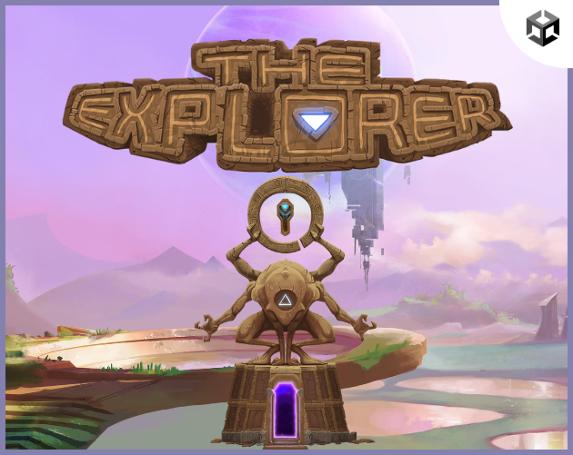
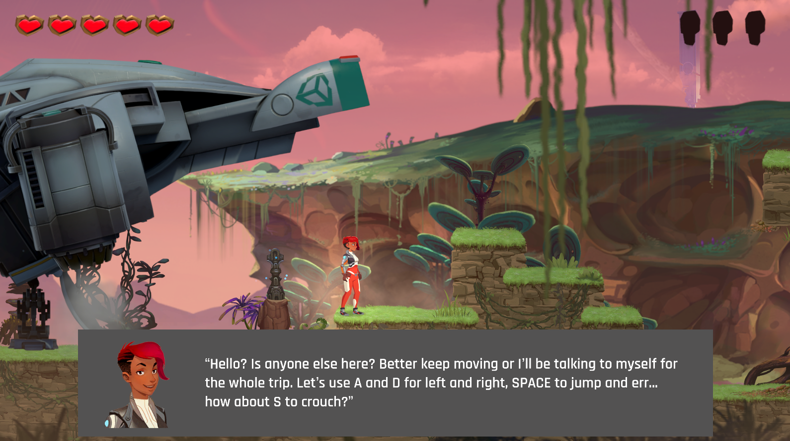
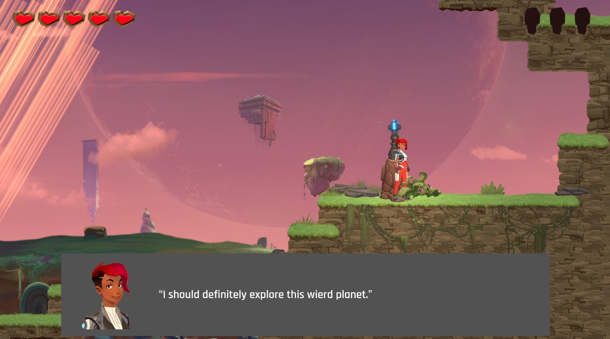
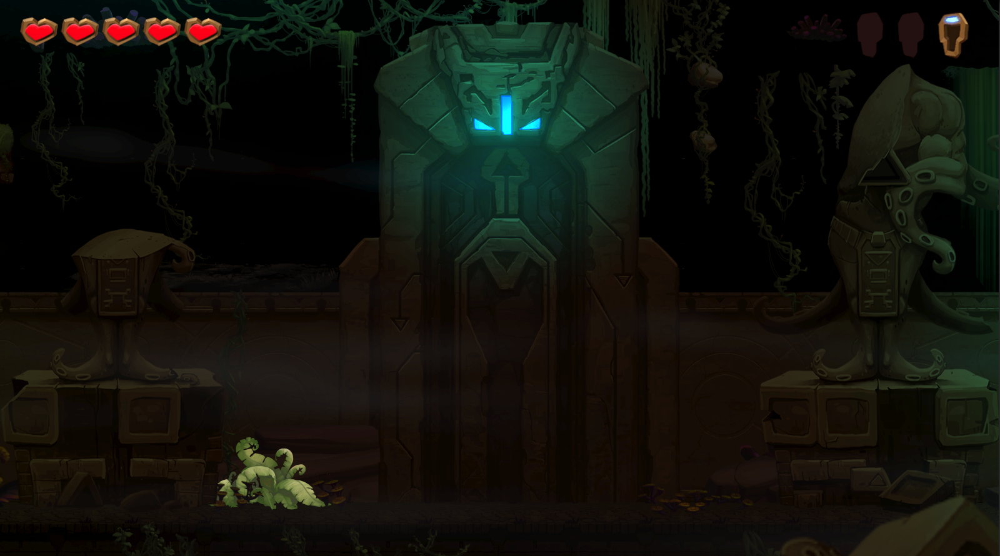
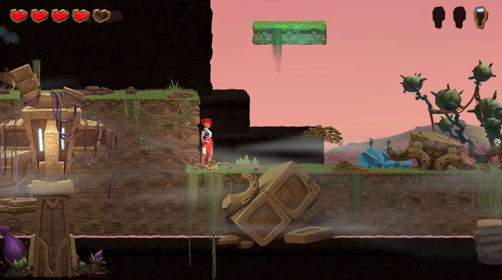
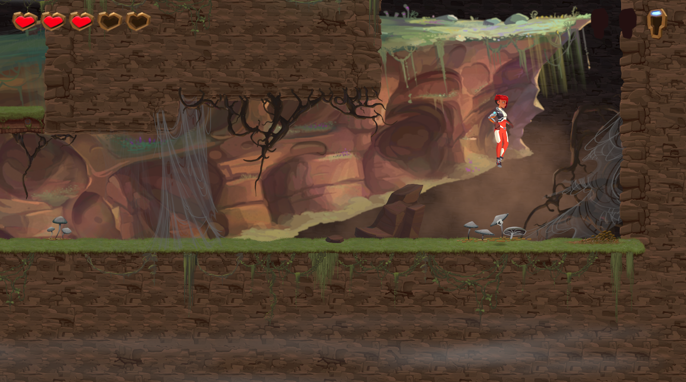

# Level-Design-Project
A Level Design Project Using Unity's 2D Game Kit.
# Unity Engine Version
2022.3.20f1
# Play the game on my itch.io page
https://faizalkhan99.itch.io/alien-resurgence
# Documentation
This project was made as a design test for a company and below is the link to the documentation.
https://docs.google.com/document/d/13nVdWNEsboeo4kMwZq8eNY9g19-UJ0rtpliVn9f7Hmw/edit?usp=sharing
# IIn-Game Screen Shots

# NOTE 1
This project was made by using Unity's 2D Game Kit and all the credits goes to the original creators as mentioned in the credits page in the game's option menu. I just designed some levels for educational purposes. I do NOT monetize this project by any means nor it is intended to infringe any copyright. I hold no rights to the project files. Unity's Game Kit is available for free for people to use and learn from it and it is exactly what is my intention.
